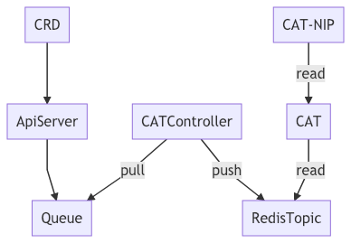

# cat

**C**entral **A**pplication **T**racker

CAT is about tracking applications.

The goal is to be able to know where which application is; it's sources, it's build environment, it's artifacts and - if it has one - it's runtime environment.

Basicly, a lightweight CMDB aimed at helping developers survive today's highly dynamic environments with ephemeral build servers, changing runtimes and so on.

It should be a scalable highly available service, that keeps track of some basic information.
More information should be a relation to external systems only, so this stays lightweight, small and fast!

## Goal

For me to learn more about Go, distributed computing, ETCD and more.

## ToDo

* add to GitOps pipeline
* write all the articles
* read from a pub/sub queue - Redis?

## Model




## Dependencies used

* Echo
* Cobra

## Examples

### Tools used

To run these applications, the following tools are used.

* [HTTPie](https://httpie.org): modern alternative to curl

### Run applications

```bash
go run main.go serve -p 7777 
```

### Get Applications

```bash
http :7777/applications --auth joe:secret
```

The response should be like this:

```json
[
    {
        "annotations": [
            {
                "Key": "MetricsGroup",
                "Origin": "com.github.joostvdg",
                "Value": "CI"
            }
        ],
        "artifactIDs": [
            "gav://com.github.joostvdg.demo:maven-demo-lib:0.1.1"
        ],
        "components": null,
        "description": "A small Maven Java library for demo purposes",
        "labels": [
            {
                "Key": "Category",
                "Value": "BuildTool"
            }
        ],
        "name": "Maven Demo Library",
        "namespace": "joostvdg",
        "sources": [
            "https://github.com/joostvdg/maven-demo-lib.git"
        ],
        "uuid": "1d23b1b0-051e-4f0f-a09e-e4c1f7ce5f0a"
    },
    {
        "annotations": [
            {
                "Key": "MetricsGroup",
                "Origin": "com.github.joostvdg",
                "Value": "CI"
            }
        ],
        "artifactIDs": [
            "https://registry.hub.docker.com/library/jenkins@sha256:81040e35ee59322a02f67ca2584f814d543d5f2f5d361fb8bf4f9e0046f3e809"
        ],
        "components": null,
        "description": "Jenkins, the most awesome CI engine",
        "labels": [
            {
                "Key": "Category",
                "Value": "BuildTool"
            }
        ],
        "name": "Jenkins",
        "namespace": "CI",
        "sources": [
            "https://github.com/jenkinsci/jenkins.git"
        ],
        "uuid": "3b85743d-0698-4572-9d93-2a86c14843ef"
    }
]
```

### Add new application

```bash
http PUT :7777/applications \
    name=Example namespace=joostvdg \
    description="Some example application" \
    sources:='["https://github.com/joostvdg/keep-watching.git"]' \
    artifactIDs:='["gav://com.github.joostvdg.demo:keep-watching:0.1.1"]' \
    labels:='[{"Key": "Category","Value": "WebApp"}]' \
    annotations:='[{"Key": "MetricsGroup", "Origin": "com.github.joostvdg", "Value": "Keep" }]' \
    --auth joe:secret
```

Response:

```bash
HTTP/1.1 201 Created
Content-Length: 407
Content-Type: application/json; charset=UTF-8
Date: Sun, 16 Sep 2018 11:39:48 GMT

{
    "annotations": [
        {
            "Key": "MetricsGroup",
            "Origin": "com.github.joostvdg",
            "Value": "Keep"
        }
    ],
    "artifactIDs": [
        "gav://com.github.joostvdg.demo:keep-watching:0.1.1"
    ],
    "components": null,
    "description": "Some example application",
    "labels": [
        {
            "Key": "Category",
            "Value": "WebApp"
        }
    ],
    "name": "Example",
    "namespace": "joostvdg",
    "sources": [
        "https://github.com/joostvdg/keep-watching.git"
    ],
    "uuid": "93c213fa-563b-48a0-9415-fb6f21c2057a"
}
```
